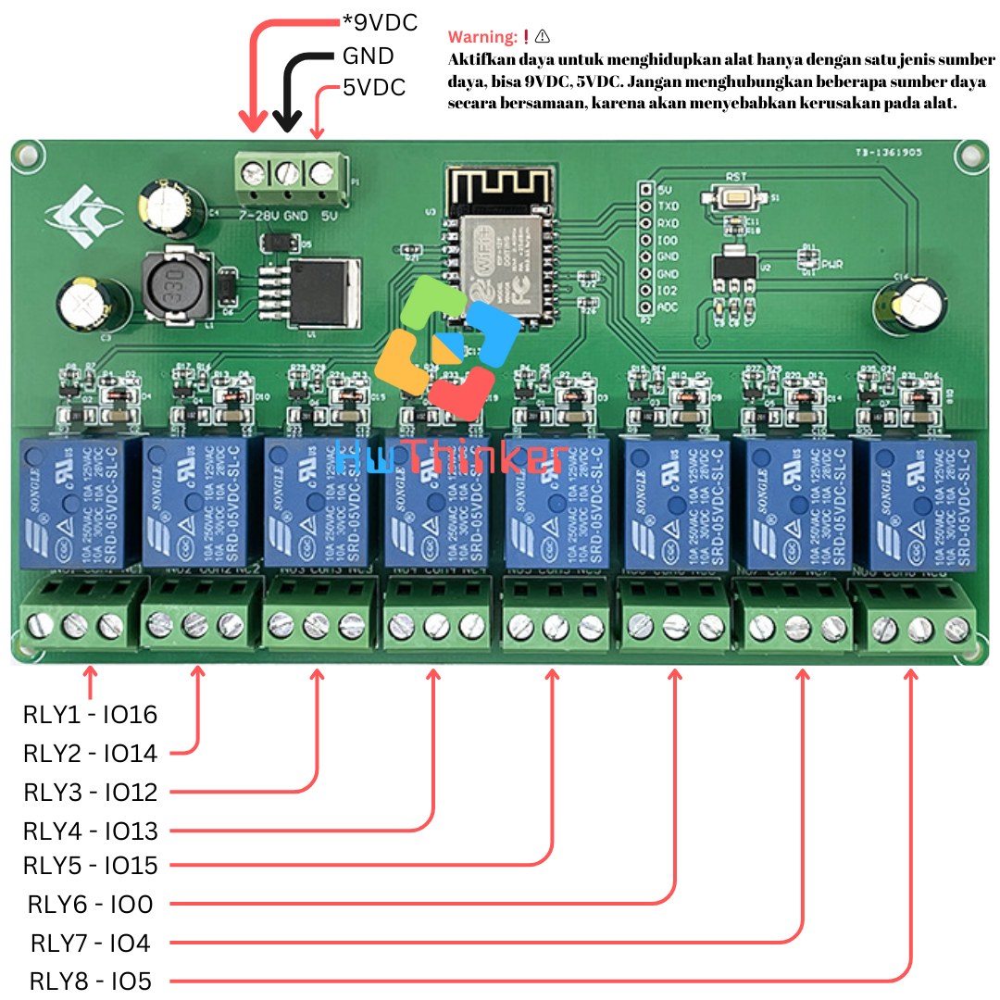
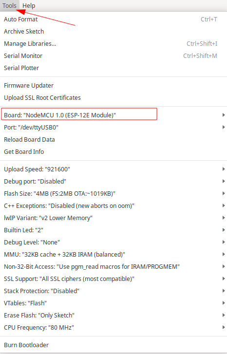
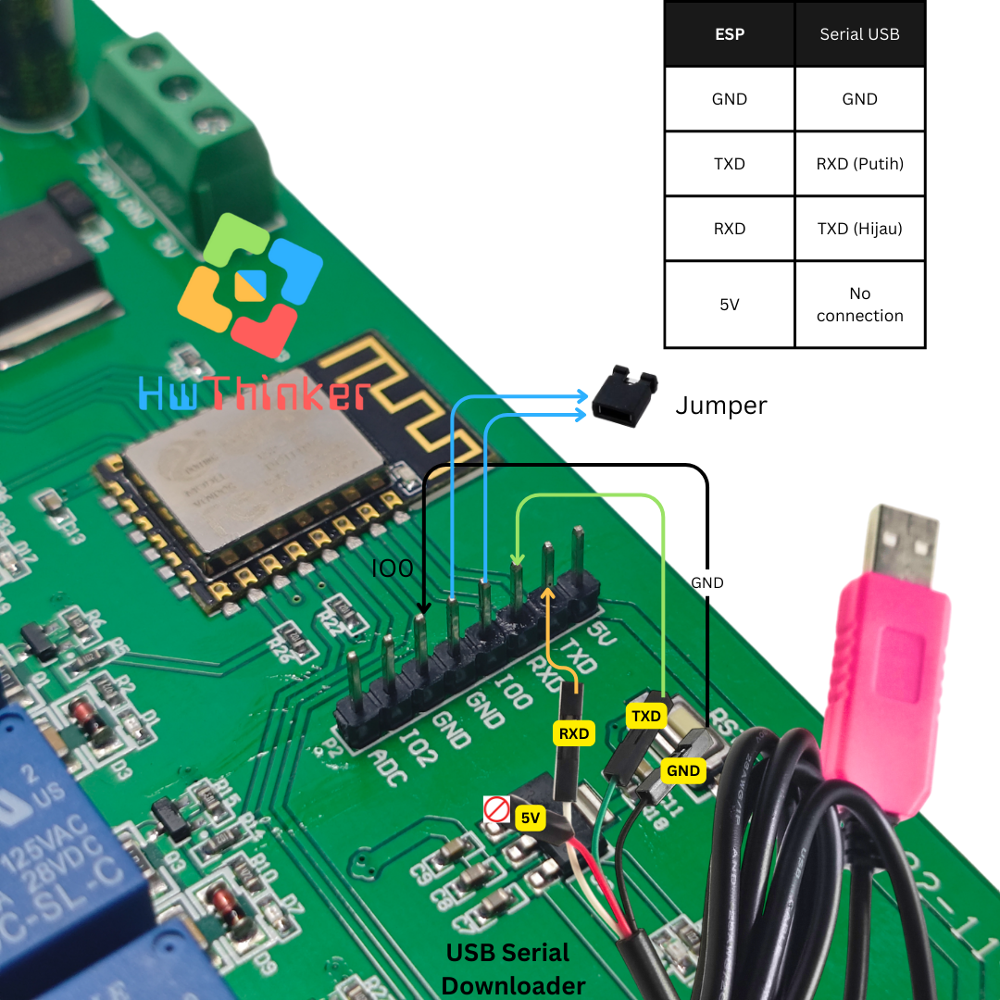

# Modul ESP8266 ESP-12F Relay 8 Channel 10A

<!-- hwthinker-store-links -->

## Beli boardnya & tutorial lengkap

**Board yang dipakai di repo ini tersedia di HwThinker Store:**

- [Modul Relay 8 Channel ch 8ch WIFI ESP-12F ESP8266 10A IOT](https://hwthinker.com/produk/427d43e0-2259-4481-a0d1-eba42896a451)

**Tutorial lengkap — langkah bergambar, troubleshooting, dan kode yang sudah diuji:**

- [Modul ESP8266 Relay 8 Channel 10A — Setup Arduino IDE dan Kontrol 8 Relay](https://hwthinker.com/tutorials/esp8266-relay-8ch-10a)

Butuh bantuan pemasangan? Sapa kami lewat live chat di [hwthinker.com](https://hwthinker.com) — barang dikirim dari Surabaya, sudah diuji sebelum dikemas.

<!-- /hwthinker-store-links -->




Board ESP8266 (ESP-12F) dengan delapan relay 10A onboard — cocok untuk kontrol banyak beban sekaligus (panel lampu, otomasi rumah multi-zona) lewat WiFi.

## Cara install plugin Arduino IDE

### Langkah 1: Buka Arduino IDE

1. Buka aplikasi Arduino IDE di komputer Anda. Jika belum ada, unduh dan instal Arduino IDE dari situs resmi Arduino di https://www.arduino.cc/en/software. disarankan menggunakan arduino ide versi 2

### Langkah 2: Tambahkan URL Board Manager untuk ESP8266

2. Di Arduino IDE, buka **File** > **Preferences**.

   

3. Pada bagian  Additional Boards Manager URLs, tambahkan URL berikut:

```
https://arduino.esp8266.com/stable/package_esp8266com_index.json
```

4. Jika sebelumnya Anda sudah memiliki URL lain di sana, pisahkan URL ini dengan tanda koma atau baris baru.


### Langkah 3: Buka Boards Manager

1. Buka **Tools** > **Board** > **Boards Manager**.


2. Di kotak pencarian, ketik **ESP8266**

### Langkah 4: Instal Board ESP8266

1. Temukan **ESP8266 by Espressif Systems** di daftar, kemudian klik **Install**.


2. Tunggu hingga proses instalasi selesai.

### Langkah 5: Pilih Board ESP8266

1. Setelah instalasi selesai, Anda dapat memilih board ESP8266.
2. Buka **Tools** > **Board**, dan gulir ke bawah untuk menemukan berbagai jenis board ESP8266 yang telah diinstal. Pilih board yang sesuai, misalnya **Nodemcu 1.0 (ESP-12E Module)** 


3. hasilnya kurang lebih seperti ini



### Langkah 6: Pilih Port

1. Sambungkan board esp8266 ke komputer Anda menggunakan kabel USB.
2. Di **Tools** > **Port**, pilih port yang sesuai dengan esp8266 Anda.

## Kode Program

```c++
#include <Arduino.h>

#define LED_ESP 2
#define RLY1 16 
#define RLY2 14  
#define RLY3 12  
#define RLY4 13  
#define RLY5 15  
#define RLY6 0   
#define RLY7 4 
#define RLY8 5  


const int relayPins[] = {RLY1, RLY2, RLY3, RLY4, RLY5, RLY6, RLY7, RLY8};
const int numRelays = sizeof(relayPins) / sizeof(relayPins[0]);
const int delayTime = 1000;  // Waktu delay dalam milidetik

void setup() {
  pinMode(LED_ESP, OUTPUT);
  for (int i = 0; i < numRelays; i++) {
    pinMode(relayPins[i], OUTPUT);
    digitalWrite(relayPins[i], LOW);  // Matikan semua relay pada awal
  }
  digitalWrite(LED_ESP, LOW);  // Matikan LED pada awal
}

void loop() {
  digitalWrite(LED_ESP, HIGH);  // Nyalakan LED saat RLY1 aktif
  for (int i = 0; i < numRelays; i++) {
    digitalWrite(relayPins[i], HIGH);  // Nyalakan relay
    delay(delayTime);

    digitalWrite(relayPins[i], LOW);  // Matikan relay
  }
  digitalWrite(LED_ESP, LOW);  // Matikan LED setelah RLY4 mati
  delay(delayTime);
}
```


## Cara download dengan Serial USB 



- Pasang serial USB TTL dengan ketentuan: 
   - TX Board-> RX USB Serial (Kabel Putih)
   - RX Board-> TX USB Serial (Kabel Hijau)
   - GND Board-> GND USB Serial (Kabel Hitam)
- Pasang jumper IO0 ke ground 
- Pasang Powersupply Ke Device dengan Jumper dalam keadaan terpasang
- Download program dan tunggu sampai selesai
- Lepas Jumper
- Cabut dan pasang Powersupply agar program yang barusan diupload di run device. ( penting❗)
- Ulangi langkah awal bila melakukan download ulang lagi


Warning:❗⚠️
Aktifkan daya untuk menghidupkan alat hanya dengan satu jenis sumber daya, bisa 9VDC atau 5VDC. Jangan menghubungkan beberapa sumber daya secara bersamaan, karena akan menyebabkan kerusakan pada alat.


